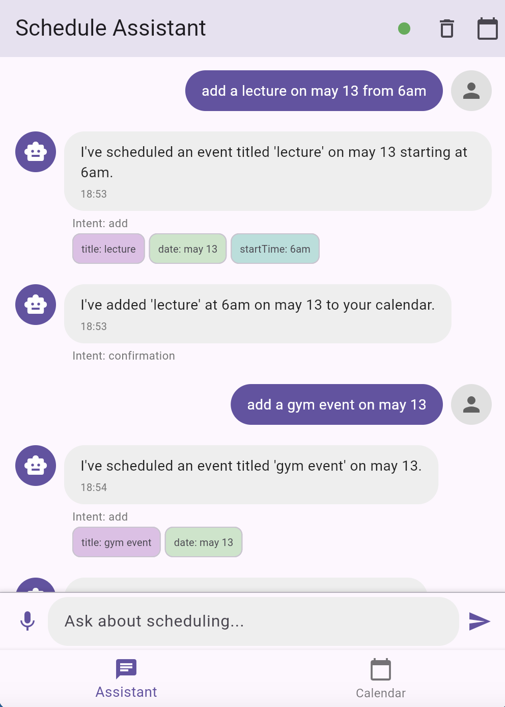
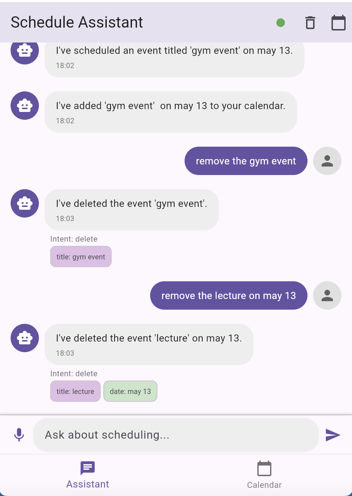
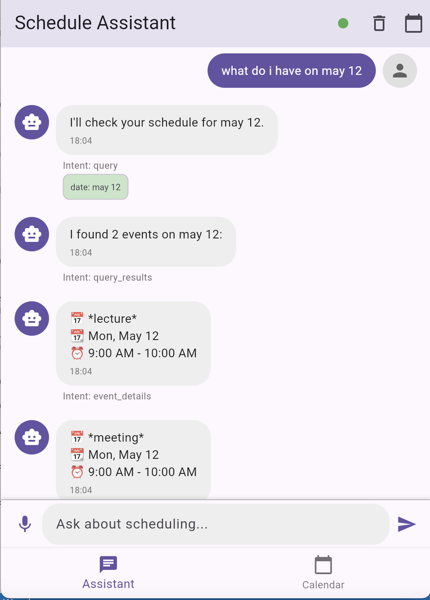
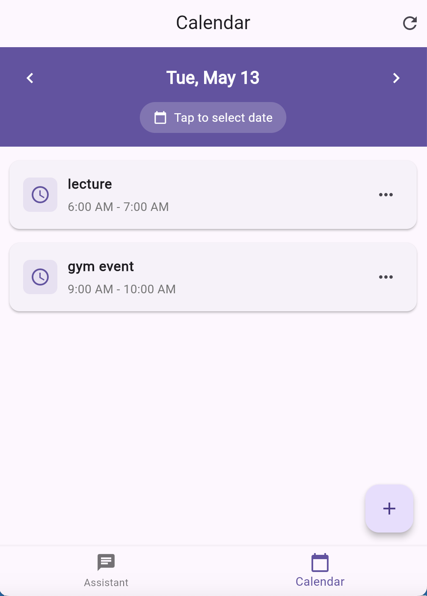

# 1. Calendar Chatbot Project Overview

## 1.1 Project Architecture

The calendar chatbot project follows a comprehensive architecture that integrates natural language processing (NLP) models with a conversational interface. The overall system consists of two main components:

1. **NLP Processing Pipeline**: A combination of models for intent classification and named entity recognition
2. **Application Framework**: A frontend-backend architecture for user interaction and data management

The following diagram illustrates the complete workflow of the system:

```
┌─────────────────────────────┐         ┌─────────────────────────────┐
│      User Input             │         │      NLP Processing         │
│                             │         │                             │
│  ┌─────────────────────┐    │         │    ┌───────────────────┐    │
│  │    Text Message     │────┼────────►│    │ Intent Classifier │    │
│  └─────────────────────┘    │         │    └──────────┬────────┘    │
│                             │         │               │             │
│  ┌─────────────────────┐    │         │    ┌──────────▼────────┐    │
│  │   Processed Result  │◄───┼─────────│    │    NER Model      │    │
│  └─────────────────────┘    │         │    └──────────┬────────┘    │
│                             │         │               │             │
│  ┌─────────────────────┐    │         │    ┌──────────▼────────┐    │
│  │  Calendar Action    │◄───┼─────────│    │ Response Generator│    │
│  └─────────────────────┘    │         │    └───────────────────┘    │
└─────────────────────────────┘         └─────────────────────────────┘
```

## 1.2 Model Architecture

The NLP system uses a two-model approach to understand user requests:

1. **Intent Classification Model**: 
   - Determines the user's primary intention (Add, Update, Delete, Query, or Chitchat)
   - Implemented using BERT embeddings with an SVM classifier
   - Achieves 99% accuracy across five intent categories

2. **Named Entity Recognition Model**:
   - Extracts key information from user messages (dates, times, event titles, locations)
   - Fine-tuned MobileBERT model with a token classification head
   - Implements BIO (Beginning-Inside-Outside) tagging scheme
   - Achieves 97% overall accuracy in entity extraction

## 1.3 Implementation Flow

The system processes user requests through the following sequence:

1. User enters a natural language request (e.g., "Add a meeting with Zhang tomorrow at 3 PM")
2. The text is sent to the backend API for processing
3. Intent classifier determines the primary intention (e.g., "ADD")
4. NER model extracts relevant entities:
   - title: "meeting with Zhang"
   - date: "tomorrow"
   - startTime: "3 PM"
5. The system generates an appropriate response
6. The frontend displays the response and updates the calendar accordingly



## 1.4 Key Features

- **Natural Language Understanding**: Processes varied phrasings and expressions
- **Entity Visualization**: Shows extracted entities through color-coded chips
- **Cross-Platform Support**: Works on mobile and web platforms
- **Offline Capability**: Stores calendar data locally with platform-specific implementations
- **Contextual Response Generation**: Creates natural language responses based on extracted information

# 2. Calendar Chatbot Model Design, Training and Evaluation Report

## Executive Summary

This report documents the design, implementation, and evaluation of a calendar chatbot system that utilizes two machine learning models:

1. **Intent Classification Model**: A model that identifies the user's intention in the message (Add, Update, Delete, Query events, or general chitchat)
2. **Named Entity Recognition (NER) Model**: A model that extracts key information from user queries (dates, times, titles, locations, etc.)

Both models show strong performance, with the intent classifier achieving 99% accuracy and the NER model achieving 97% accuracy on their respective tasks. The system is designed to help users manage calendar events through natural language interactions.

## 2.1. Datasets

### 2.1.1 Intent Classification Dataset

The intent classification dataset consists of labeled examples for five distinct intents:

| Intent   | Description                  | Examples                                       | Count |
| -------- | ---------------------------- | ---------------------------------------------- | ----- |
| ADD      | Add new events to calendar   | "Add a meeting with Zhang tomorrow at 3 PM"    | 61    |
| UPDATE   | Modify existing events       | "Move my dentist appointment to next Thursday" | 52    |
| DELETE   | Remove events from calendar  | "Cancel my flight to Shanghai"                 | 49    |
| QUERY    | Request calendar information | "What meetings do I have tomorrow?"            | 45    |
| CHITCHAT | General conversation         | "Hello, how are you today?"                    | 46    |

The dataset contains a total of 253 examples distributed across these five intent categories, stored in JSON format. The dataset shows good balance across the different intent classes, which helps prevent bias in the trained model.

### 2.1.2 Named Entity Recognition (NER) Dataset

The NER dataset is formatted in the BIO (Beginning-Inside-Outside) tagging scheme, where:

- **B-** prefix indicates the beginning of an entity
- **I-** prefix indicates the continuation of an entity
- **O** indicates tokens that are not part of any entity

The following entity types are included in the dataset:

| Entity Type             | Description       | Examples                              |
| ----------------------- | ----------------- | ------------------------------------- |
| B-title/I-title         | Event title       | "meeting", "dentist appointment"      |
| B-date/I-date           | Date of event     | "tomorrow", "next Monday", "May 20th" |
| B-startTime/I-startTime | Start time        | "3 PM", "10 AM"                       |
| B-endTime/I-endTime     | End time          | "5 PM"                                |
| B-location/I-location   | Location          | "Conference Room B", "Cafe Milano"    |
| B-action                | Action verbs      | "add", "schedule", "create"           |
| I-description           | Event description | Various descriptive details           |

The dataset contains 4,008 tokens across various calendar-related sentences, providing sufficient examples for training a robust NER model.

## 2.2 Model Selection and Design

### 2.2.1 Intent Classification Model

#### 2.2.1.1 Model Selection Rationale

For intent classification, we implemented a two-step approach:

1. **Feature Extraction**: Using BERT embeddings from "distilbert-base-uncased" to convert text to meaningful vector representations
2. **Classification**: Comparing Support Vector Machine (SVM) and Random Forest classifiers

This approach was chosen for several reasons:

- **BERT embeddings** capture semantic and contextual information in the text, providing rich features for the classifier
- **SVM and Random Forest** are effective for smaller datasets and provide good interpretability
- **Computational efficiency**: Using pre-trained BERT for embeddings and traditional ML models for classification is less resource-intensive than fine-tuning the entire BERT model

#### 2.2.1.2 Design Details

The intent classification pipeline works as follows:

1. Extract the [CLS] token embedding from DistilBERT for each text input (768-dimensional vector)
2. Train classifiers (SVM and Random Forest) on these embeddings
3. Use grid search with cross-validation to find optimal hyperparameters
4. Select the best-performing model based on validation accuracy

The hyperparameter grid for SVM included:

- C: [0.1, 1, 10, 100]
- gamma: ['scale', 'auto']
- kernel: ['linear', 'rbf']

The hyperparameter grid for Random Forest included:

- n_estimators: [100, 200]
- max_depth: [None, 10, 20]
- min_samples_split: [2, 5, 10]

### 2.2.2 Named Entity Recognition (NER) Model

#### 2.2.2.1 Model Selection Rationale

For NER, we chose to fine-tune MobileBERT, a lightweight version of BERT optimized for mobile devices. The reasons for this selection include:

- **Effectiveness for token classification tasks**: Transformer-based models have proven highly effective for NER tasks
- **Efficiency**: MobileBERT is smaller and faster than standard BERT while maintaining good performance
- **Contextual understanding**: The model can disambiguate entity types based on context (e.g., understanding that "3 PM" is a time and "next Monday" is a date)
- **Transfer learning advantage**: By fine-tuning a pre-trained model, we can achieve good performance with relatively limited training data

#### 2.2.2.2 Design Details

The NER model design involves:

1. Using the pre-trained "google/mobilebert-uncased" model as the base
2. Adding a token classification head on top for NER
3. Fine-tuning the model on our BIO-tagged calendar data
4. Handling subtoken alignment to ensure proper entity labeling

The model was configured to identify 14 distinct entity tags (including the Outside tag), with special handling for subword tokenization to ensure tokens split by the tokenizer maintain their correct labels.

## 2.3 Training Implementation

### 2.3.1 Intent Classification Training

The training process for the intent classifier was implemented in the script `intent_classifier_train_script.py` with the following key steps:

```python
# Load and prepare data
train_df, test_df, label_encoder = load_and_prepare_data("../data/intent_classification_data.json")

# Get BERT embeddings for text
X_train = get_bert_embeddings(train_df['text'].tolist())
X_test = get_bert_embeddings(test_df['text'].tolist())

# Train SVM with grid search
svm = GridSearchCV(
    SVC(probability=True, random_state=SEED),
    svm_params,
    cv=5,
    n_jobs=-1,
    verbose=1
)
svm.fit(X_train, y_train)

# Train Random Forest with grid search
rf = GridSearchCV(
    RandomForestClassifier(random_state=SEED),
    rf_params,
    cv=5,
    n_jobs=-1,
    verbose=1
)
rf.fit(X_train, y_train)

# Evaluate and select best model
svm_preds = svm.predict(X_test)
rf_preds = rf.predict(X_test)
# ... (evaluation code)

# Save the best performing model
if svm.best_score_ > rf.best_score_:
    best_classifier = svm
else:
    best_classifier = rf
```

The training used a 80/20 train/test split with stratification to maintain class distribution. Cross-validation with grid search was employed to find optimal hyperparameters.

### 2.3.2 NER Model Training

The NER model training was implemented in `finetune_mobilebert_ner.py` with the following key components:

```python
# Load BIO-formatted data
dataset = read_bio_data("../data/ner_bio_format.txt")

# Create label mappings
unique_labels = sorted(set(tag for tags in dataset["ner_tags"] for tag in tags))
label2id = {label: i for i, label in enumerate(unique_labels)}
id2label = {i: label for label, i in label2id.items()}

# Load tokenizer and model
model_name = "google/mobilebert-uncased"
tokenizer = AutoTokenizer.from_pretrained(model_name)
model = AutoModelForTokenClassification.from_pretrained(
    model_name, 
    num_labels=len(unique_labels), 
    id2label=id2label, 
    label2id=label2id
)

# Tokenize and align labels
tokenized_dataset = dataset.map(tokenize_and_align_labels, batched=False)

# Training setup
args = TrainingArguments(
    output_dir="../models/mobilebert-ner",
    learning_rate=5e-5,
    per_device_train_batch_size=16,
    num_train_epochs=5,
    weight_decay=0.01,
    save_total_limit=1,
    save_strategy="epoch",
)

# Train model
trainer = Trainer(
    model=model,
    args=args,
    train_dataset=tokenized_dataset,
    tokenizer=tokenizer,
    data_collator=DataCollatorForTokenClassification(tokenizer),
)
trainer.train()
```

The training process addressed the subword tokenization issue by handling special tokens and ensuring proper alignment of labels with tokens. The model was trained for 5 epochs with a learning rate of 5e-5 and batch size of 16.

## 2.4 Evaluation Results

### 2.4.1 Intent Classification Model Performance

The SVM classifier with BERT embeddings outperformed the Random Forest model and was selected as the final model. The evaluation results are as follows:

| Intent           | Precision | Recall | F1-Score | Support |
| ---------------- | --------- | ------ | -------- | ------- |
| ADD              | 1.00      | 0.97   | 0.98     | 61      |
| CHITCHAT         | 1.00      | 1.00   | 1.00     | 46      |
| DELETE           | 1.00      | 1.00   | 1.00     | 49      |
| QUERY            | 1.00      | 1.00   | 1.00     | 45      |
| UPDATE           | 0.96      | 1.00   | 0.98     | 52      |
| **Accuracy**     |           |        | **0.99** | 253     |
| **Macro Avg**    | 0.99      | 0.99   | 0.99     | 253     |
| **Weighted Avg** | 0.99      | 0.99   | 0.99     | 253     |

The best SVM hyperparameters were:

- C: 100
- gamma: 'scale'
- kernel: 'rbf'

This configuration achieved an excellent overall accuracy of 99%, with perfect classification for CHITCHAT, DELETE, and QUERY intents. The model showed slightly lower performance on ADD and UPDATE intents, which is expected given their potential similarity in certain contexts.

### 2.4.2 NER Model Performance

The fine-tuned MobileBERT model for NER achieved the following results:

| Entity Type      | Precision | Recall | F1-Score | Support |
| ---------------- | --------- | ------ | -------- | ------- |
| B-action         | 1.00      | 0.79   | 0.88     | 24      |
| B-date           | 0.97      | 0.97   | 0.97     | 264     |
| B-endTime        | 0.00      | 0.00   | 0.00     | 2       |
| B-location       | 0.94      | 0.56   | 0.70     | 27      |
| B-startTime      | 0.97      | 0.97   | 0.97     | 115     |
| B-title          | 0.96      | 0.94   | 0.95     | 416     |
| I-date           | 0.98      | 0.97   | 0.98     | 160     |
| I-description    | 0.00      | 0.00   | 0.00     | 1       |
| I-endTime        | 0.00      | 0.00   | 0.00     | 2       |
| I-location       | 0.90      | 0.90   | 0.90     | 20      |
| I-startTime      | 0.98      | 0.99   | 0.98     | 90      |
| I-title          | 0.94      | 0.97   | 0.96     | 574     |
| O                | 0.98      | 0.99   | 0.98     | 2313    |
| **Accuracy**     |           |        | **0.97** | 4008    |
| **Macro Avg**    | 0.74      | 0.70   | 0.71     | 4008    |
| **Weighted Avg** | 0.97      | 0.97   | 0.97     | 4008    |

The model showed strong performance for most entity types, with an overall accuracy of 97%. The performance was particularly strong for identifying dates, times, and titles, which are the most critical components for a calendar application.

Some entity types (B-endTime, I-endTime, I-description) show low performance due to very limited examples in the dataset (only 1-2 instances). This indicates areas for potential dataset improvement in future iterations.

## 2.5 Challenges and Limitations

### 2.5.1 Intent Classification Challenges

1. **Similar intents**: Distinguishing between ADD and UPDATE intents can be challenging in some cases
2. **Limited dataset size**: While 253 examples is sufficient for this application, a larger dataset would improve robustness
3. **Language variations**: The current model may not handle all variations in how users phrase their requests

### 2.5.2 NER Challenges

1. **Imbalanced entity distribution**: Some entity types have very few examples (e.g., endTime, description)
2. **Context dependency**: Understanding that "next Friday" is a date but "this" in "this meeting" is not
3. **Token alignment**: Ensuring proper handling of subtokens in the tokenization process

## 2.6 Conclusion and Future Work

The calendar chatbot system demonstrates strong performance in both intent classification and named entity recognition, with 99% and 97% accuracy respectively. The models successfully identify user intentions and extract relevant information for calendar management tasks.

### 2.6.1 Future Improvements

1. **Dataset enrichment**: Add more examples for underrepresented entity types and edge cases
2. **Model enhancements**:
   - Experiment with joint learning of intent and entity recognition
   - Explore more lightweight models for even faster inference
   - Try different pre-trained language models as the base
3. **System integration**:
   - Implement dialogue management to handle ambiguous or incomplete requests
   - Add a confirmation mechanism for calendar actions
   - Incorporate context from previous interactions

# 3. Calendar Chatbot: Detailed Implementation Specification

## 3.1 Development Process, Structure and Use Cases

### 3.1.1 Development Methodology

The development of the Calendar Chatbot application followed an iterative approach with distinct phases:

1. **Requirements Analysis**: Identifying core functionality (adding, querying, updating, deleting events)

2. **API Contract Definition**: Establishing communication protocols between frontend and backend

3. **Component Development**

   :

   - Backend: Flask API and NLP model integration
   - Frontend: Flutter UI components and local data management

4. **Integration Testing**: Ensuring frontend-backend communication works correctly

5. **UI/UX Refinement**: Optimizing the conversational interface based on user feedback

```
┌─────────────────────────────┐         ┌─────────────────────────────┐
│      Frontend (Flutter)     │         │      Backend (Flask)        │
│                             │         │                             │
│  ┌─────────────────────┐    │         │    ┌───────────────────┐    │
│  │    User Interface   │    │         │    │   API Endpoints   │    │
│  └──────────┬──────────┘    │         │    └──────────┬────────┘    │
│             │               │         │               │             │
│  ┌──────────┴──────────┐    │  REST   │    ┌──────────┴────────┐    │
│  │   Request Handling  │◄───┼────────►│    │ Request Processing│    │
│  └──────────┬──────────┘    │   API   │    └──────────┬────────┘    │
│             │               │         │               │             │
│  ┌──────────┴──────────┐    │         │    ┌──────────┴────────┐    │
│  │ Local Data Storage  │    │         │    │   NLP Processing  │    │
│  └─────────────────────┘    │         │    └───────────────────┘    │
└─────────────────────────────┘         └─────────────────────────────┘
```

### 3.1.2 Application Structure

#### 3.1.2.1 Frontend (Flutter)

```
lib/
├── main.dart                    # Application entry point
├── pages/
│   ├── chatbot_page.dart        # Main chat interface
│   └── calendar_page.dart       # Calendar view
├── models/
│   ├── message_model.dart       # Chat message data model
│   └── event_model.dart         # Calendar event data model
├── utils/
│   └── chatbot_helper.dart      # API and processing utilities
└── database/
    └── database_helper.dart     # Data persistence management
```

#### 3.1.2.2 Backend (Flask)

```
server/
├── app.py                       # Flask application entry point
├── models/
│   ├── intent_classifier        # Intent classification model
│   └── ner_model                # Named entity recognition model
├── utils.py       					     # Response generation utilities
│       
└── models.py                    # Load models and predict
```

### 3.1.3 Key Use Cases and Screenshots

The application supports several key use cases, as demonstrated in the following screenshots:

1. **Natural Language Event Creation**

   - User says: "add a lecture on may 13 from 6am"
   - System extracts entities: date=may 13, startTime=6 am, title=lecture
   - System creates the event and confirms with message feedback

   

2. **Event Removal**

   1. User says: "remove the gym event"

   2. System extracts entities: title = gym

   3. System searches and removes the event and confirms with message feedback

      

3. **Calendar Querying**

   - User asks: "what do i have on may 12?"
   - System queries events and displays results in a structured format

   

   

4. **Interactive Calendar View**

   - User taps calendar icon to view events in traditional calendar format

   

## 3.2 Frontend Implementation

### 3.2.1 UI Component Architecture

The frontend follows a component-based architecture with two main screens:

1. **ChatbotPage**: The primary interface for conversation
   - Message list for chat history
   - Message composer for user input
   - Entity visualization components
   - Connection status indicator
2. **CalendarPage**: Traditional calendar visualization
   - Month/week/day views
   - Event listing and details
   - Creation and editing interfaces

The implementation uses Flutter's widget composition pattern, breaking down complex interfaces into reusable components:

```dart
// Example of component composition for message display
Widget _buildMessage(MessageModel message) {
  return Container(
    margin: EdgeInsets.symmetric(vertical: 10.0, horizontal: 8.0),
    child: Row(
      mainAxisAlignment: 
          message.isUser ? MainAxisAlignment.end : MainAxisAlignment.start,
      crossAxisAlignment: CrossAxisAlignment.start,
      children: [
        if (!message.isUser) _buildAvatarIcon(),
        _buildMessageBubble(message),
        if (message.isUser) _buildUserAvatar(),
      ],
    ),
  );
}
```

### 3.2.2 State Management

The application employs a StatefulWidget approach for state management:

1. **Local Component State**: For UI-specific states like loading indicators
2. **In-Memory State**: For temporary data during operation
3. **Persistent Storage**: For messages and calendar events
4. **Reactive Updates**: UI components update in response to state changes

```dart
// Example of state management in the ChatbotPage
class _ChatbotPageState extends State<ChatbotPage> {
  final TextEditingController _textController = TextEditingController();
  List<MessageModel> _messages = [];
  bool _isLoading = false;
  bool _isConnected = true;
  
  // State update example
  void _addUserMessage(String text) {
    // Create message model
    final message = MessageModel(
      id: 0,
      text: text,
      isUser: true,
      timestamp: DateTime.now(),
    );
    
    // Update UI state
    setState(() {
      _messages.add(message);
    });
    
    // Persist to database
    ChatbotHelper.saveMessage(text, true);
  }
}
```

### 3.2.3 Cross-Platform Data Persistence

The frontend implements a platform-aware persistence strategy:

1. **Mobile Implementation**: Uses SQLite for efficient local storage

   ```dart
   // SQLite database initialization for mobile
   Future<Database> _initDB(String filePath) async {
     final dbPath = await getDatabasesPath();
     final path = join(dbPath, filePath);
     
     return await openDatabase(
       path,
       version: 1,
       onCreate: _createDB,
     );
   }
   ```

2. **Web Implementation**: Uses SharedPreferences for browser-compatible storage

   ```dart
   // Web storage implementation
   Future<int> insertEvent(EventModel event) async {
     final prefs = await SharedPreferences.getInstance();
     int nextId = (prefs.getInt('next_event_id') ?? 0) + 1;
     
     // Store serialized event
     await prefs.setString('event_$nextId', jsonEncode(event.toMap()));
     await prefs.setInt('next_event_id', nextId);
     
     return nextId;
   }
   ```

3. **Unified Interface**: Abstract methods hide platform-specific implementations

   ```dart
   // Unified query interface
   Future<List<EventModel>> queryEvents(Map<String, dynamic> whereClause) async {
     if (kIsWeb) {
       return _queryEventsWeb(whereClause);
     } else {
       return _queryEventsMobile(whereClause);
     }
   }
   ```

### 3.2.4 Natural Language Processing Visualization

A key frontend innovation is the visualization of NLP understanding through entity chips:

```dart
Widget _buildEntityChips(List<dynamic> entities) {
  // Process and deduplicate entities
  Map<String, String> entityMap = {};
  
  for (var entity in entities) {
    String type = entity['type'] as String;
    String text = entity['text'] as String;
    
    // Handle B-I-O tagging scheme
    if (type.startsWith('B-')) {
      type = type.substring(2);
      entityMap[type] = text;
    } else if (type.startsWith('I-')) {
      type = type.substring(2);
      if (entityMap.containsKey(type)) {
        entityMap[type] = '${entityMap[type]!} $text';
      } else {
        entityMap[type] = text;
      }
    } else {
      entityMap[type] = text;
    }
  }
  
  // Render entity chips with color coding
  return Wrap(
    spacing: 4.0,
    runSpacing: 4.0,
    children: entityMap.entries.map((entry) {
      return Chip(
        materialTapTargetSize: MaterialTapTargetSize.shrinkWrap,
        label: Text(
          '${entry.key}: ${entry.value}',
          style: TextStyle(fontSize: 10.0),
        ),
        backgroundColor: _getEntityColor(entry.key),
        padding: EdgeInsets.all(0),
        labelPadding: EdgeInsets.symmetric(horizontal: 8.0),
      );
    }).toList(),
  );
}
```

This approach provides users with immediate visual feedback on how their natural language input is understood by the system, enhancing transparency and user confidence.

### 3.2.4 Detailed Implementation 

#### 3.2.4.1 `models/message_model.dart`

This file defines the data structure for chat messages with serialization support.

**Key Attributes:**

- `id`: Unique identifier
- `text`: Message content
- `isUser`: Boolean indicating if sent by user
- `timestamp`: Date and time sent
- `intent`: NLP-identified intent (for bot messages)
- `entities`: Extracted entities (for bot messages)

**Key Methods:**

```dart
// Constructor
MessageModel({
  required this.id,
  required this.text,
  required this.isUser,
  required this.timestamp,
  this.intent,
  this.entities,
});

// Convert to Map for database storage
Map<String, dynamic> toMap() {...}

// Create from Map for database retrieval
factory MessageModel.fromMap(Map<String, dynamic> map) {...}
```

#### 3.2.4.2 `models/event_model.dart`

This file defines the data structure for calendar events.

**Key Attributes:**

- `id`: Unique identifier
- `title`: Event title
- `description`: Event details
- `date`: ISO format date string
- `startTime`: ISO format date-time string
- `endTime`: ISO format date-time string
- `location`: Event location
- `isAllDay`: Flag for all-day events

**Key Methods:**

```dart
// Constructor
EventModel({
  required this.id,
  required this.title,
  required this.description,
  required this.date,
  required this.startTime,
  required this.endTime,
  required this.location,
  required this.isAllDay,
});

// Convert to Map for database storage
Map<String, dynamic> toMap() {...}

// Create from Map for database retrieval
factory EventModel.fromMap(Map<String, dynamic> map) {...}
```

#### 3.2.4.3 `database/database_helper.dart`

This file manages data persistence across platforms with a unified interface.

**Key Attributes:**

- `_database`: SQLite database instance (mobile)
- `instance`: Singleton instance

**Key Methods:**

```dart
// Get database instance (platform-aware)
Future<Database> get database async {...}

// Initialize SQLite database (mobile only)
Future<Database> _initDB(String filePath) async {...}

// Create database tables
Future _createDB(Database db, int version) async {...}

// Insert message into database
Future<int> insertMessage(MessageModel message) async {...}

// Get all messages
Future<List<MessageModel>> getAllMessages() async {...}

// Clear all messages
Future<int> clearAllMessages() async {...}

// Insert event into database
Future<int> insertEvent(EventModel event) async {...}

// Get all events
Future<List<EventModel>> getAllEvents() async {...}

// Get recent events
Future<List<EventModel>> getRecentEvents(int limit) async {...}

// Query events with filters
Future<List<EventModel>> queryEvents(Map<String, dynamic> whereClause) async {...}

// Update event
Future<int> updateEvent(EventModel event) async {...}

// Delete event
Future<int> deleteEvent(int id) async {...}
```

**Implementation Details:**

- Platform detection with `kIsWeb` for different storage strategies
- SQLite for mobile platforms
- SharedPreferences for web platform
- Transaction management for database operations
- Error handling with try-catch blocks

#### 3.2.4.4 `utils/chatbot_helper.dart`

This utility class handles API communication and data processing for the chatbot functionality.

**Key Attributes:**

- `apiBaseUrl`: Backend server address (platform-aware)
- `_dbHelper`: Database helper instance

**Key Methods:**

```dart
// Analyze text using NLP API
static Future<Map<String, dynamic>> analyzeText(String text) async {...}

// Check backend health
static Future<bool> checkHealth() async {...}

// Parse API response
static Map<String, dynamic> parseResponse(Map<String, dynamic> apiResponse) {...}

// Process intent based on type
static Future<bool> processIntent(String intent, Map<String, dynamic> parsedData) async {...}

// Save message to database
static Future<int> saveMessage(String text, bool isUser) async {...}

// Get all messages from database
static Future<List<MessageModel>> getAllMessages() async {...}

// Clear message history
static Future<int> clearMessages() async {...}

// Create calendar event
static Future<void> _createCalendarEvent(Map<String, dynamic> data) async {...}

// Delete calendar event
static Future<void> _deleteCalendarEvent(Map<String, dynamic> data) async {...}

// Update calendar event
static Future<void> _updateCalendarEvent(Map<String, dynamic> data) async {...}

// Query calendar events (internal)
static Future<List<EventModel>> _queryCalendarEvents(Map<String, dynamic> data) async {...}

// Query calendar events (public interface)
static Future<List<EventModel>> queryCalendarEvents(Map<String, dynamic> data) async {...}

// Parse date string to DateTime
static DateTime _parseDate(String dateStr) {...}

// Get next specific weekday
static DateTime _getNextWeekday(int targetWeekday) {...}

// Parse time string to TimeOfDay
static TimeOfDay _parseTime(String timeStr) {...}
```

**Implementation Details:**

- HTTP requests with error handling and timeouts
- Platform-specific API URLs
- JSON encoding/decoding for API communication
- Sophisticated date/time parsing with regex pattern matching
- Entity extraction and processing
- Support for relative temporal expressions ("tomorrow", "next week")
- Event matching and manipulation logic

#### 3.2.4.5 `pages/chatbot_page.dart`

This file implements the main chat interface for the application.

**Key Attributes:**

- `_textController`: Controls text input field
- `_messages`: List of chat messages
- `_isLoading`: Loading state indicator
- `_isConnected`: Backend connection status
- `_scrollController`: Controls message list scrolling

**Key Methods:**

```dart
// Initialize chat interface
void initState() {...}
Future<void> _initializeChat() async {...}

// Handle user message submission
void _handleSubmitted(String text) async {...}

// Extract entity value from entity list
String? _getEntityValue(List<dynamic>? entities, String type) {...}

// Display query results
void _displayQueryResults(List<EventModel> events, Map<String, dynamic> queryParams) {...}

// Add user message to UI and database
void _addUserMessage(String text) {...}

// Add bot message to UI and database
void _addBotMessage(String text, {String? intent, List<dynamic>? entities}) {...}

// Scroll chat to bottom
void _scrollToBottom() {...}

// Clear chat history
void _clearChat() {...}

// Build main UI
Widget build(BuildContext context) {...}

// Build individual message
Widget _buildMessage(MessageModel message) {...}

// Build entity visualization chips
Widget _buildEntityChips(List<dynamic> entities) {...}

// Get color for entity type
Color _getEntityColor(String type) {...}

// Build message composition area
Widget _buildMessageComposer() {...}
```

**Implementation Details:**

- StatefulWidget lifecycle management
- Asynchronous API calls with loading indicators
- Entity visualization with colored chips
- B-I-O tag handling for multi-word entities
- Connection status monitoring and visual feedback
- ScrollController for automatic scrolling to latest messages
- Error handling with user feedback
- Dialog confirmation for destructive actions

#### 3.2.4.6 `pages/calendar_page.dart`

This file implements the calendar view for event visualization and management.

**Key Attributes:**

- `_selectedDate`: Currently selected date
- `_events`: Map of events by date
- `_calendarFormat`: Display format (month, week, day)

**Key Methods:**

```dart
// Initialize calendar view
void initState() {...}
Future<void> _loadEvents() async {...}

// Handle date selection
void _onDaySelected(DateTime day, List events) {...}

// Format events for display
List<EventModel> _getEventsForDay(DateTime day) {...}

// Build main UI
Widget build(BuildContext context) {...}

// Build calendar widget
Widget _buildCalendar() {...}

// Build event list for selected day
Widget _buildEventList() {...}

// Build event card
Widget _buildEventCard(EventModel event) {...}

// Show event details dialog
void _showEventDetails(EventModel event) {...}

// Show event edit dialog
void _showEventEditForm(EventModel? event) {...}
```

**Implementation Details:**

- TableCalendar widget integration
- Date formatting and manipulation
- Event grouping by date
- Modal dialogs for event management
- Form validation for event creation/editing
- Delete confirmation with undo option
- Date and time picker integration

## 3.3 Backend Implementation

### 3.3.1 API Endpoint Design

The backend exposes two primary endpoints:

1. **`/analyze` (POST)**: Processes natural language input and returns structured data

   ```
   Request: {"text": "Schedule a meeting tomorrow at 2pm"}
   Response: {
     "intent": {"name": "add", "confidence": 0.95},
     "entities": [
       {"type": "title", "text": "meeting", "start": 10, "end": 17},
       {"type": "date", "text": "tomorrow", "start": 18, "end": 26},
       {"type": "startTime", "text": "2pm", "start": 30, "end": 33}
     ],
     "response": "I'll schedule a meeting for tomorrow at 2:00 PM."
   }
   ```

2. **`/health` (GET)**: Provides system status for connectivity checks

   ```
   Response: {"status": "healthy"}
   ```

### 3.3.2 NLP Model Integration

The backend integrates pre-trained NLP models through the following process:

1. **Text Preprocessing**: Normalization, tokenization, and feature extraction
2. **Intent Classification**: Determining the user's intention (add, query, update, delete)
3. **Named Entity Recognition**: Extracting relevant information (dates, times, titles, locations)
4. **Response Generation**: Creating appropriate text responses based on the identified intent and entities

The NER model implementation uses the B-I-O (Beginning-Inside-Outside) tagging scheme to handle multi-word entities, allowing accurate extraction of complex phrases like "next Tuesday afternoon" or "team strategy meeting".

### 3.3.3 Data Processing Pipeline

The backend implements a sequential processing pipeline:

1. **Request Parsing**: Extracting the user's message from the request
2. **Intent Classification**: Running the message through the intent model
3. **Entity Extraction**: Applying the NER model to identify key information
4. **Response Construction**: Generating appropriate responses based on intent and entities
5. **JSON Serialization**: Formatting the data for frontend consumption

This pipeline architecture ensures consistent processing of user inputs and facilitates testing and debugging of individual components.

### 3.3.4 Detailed Implementation 

#### 3.3.4.1  `app.py`

This file serves as the entry point for the Flask application.

**Key Components:**

- Flask application initialization
- NLP model loading
- API endpoint registration
- CORS configuration for cross-origin requests
- Error handling middleware

**Key Routes:**

```python
# Health check endpoint
@app.route('/health', methods=['GET'])
def health_check():
    return jsonify({'status': 'healthy'})

# Text analysis endpoint
@app.route('/analyze', methods=['POST'])
def analyze_text():
    # Get request data
    data = request.json
    
    # Process with NLP models
    result = process_text(data['text'])
    
    # Return structured response
    return jsonify(result)
```

#### 3.3.4.2 `utils.py`

This file generates appropriate responses based on identified intent and entities.

**Key Methods:**

```python
# Generate response based on intent and entities
def generate_response(intent, entities):
    if intent['name'] == 'add':
        return generate_add_response(entities)
    elif intent['name'] == 'query':
        return generate_query_response(entities)
    elif intent['name'] == 'update':
        return generate_update_response(entities)
    elif intent['name'] == 'delete':
        return generate_delete_response(entities)
    else:
        return generate_chitchat_response(entities)

# Generate response for add intent
def generate_add_response(entities):
    # Extract relevant entities
    title = get_entity_text(entities, 'title') or 'event'
    date = get_entity_text(entities, 'date') or 'your calendar'
    time = get_entity_text(entities, 'startTime')
    
    # Construct natural response
    response = f"I'll add {title} to {date}"
    if time:
        response += f" at {time}"
    
    return response + "."
```

#### 3.3.4.3 `models.py`

This file defines the API endpoints and coordinates processing.

**Key Methods:**

```python
# Load models
def load_models(self):
  	...
# Process text with NLP pipeline
def process_text(text):
    # Classify intent
    intent = intent_classifier.classify_intent(text)
    
    # Extract entities
    entities = ner_model.extract_entities(text)
    
    # Generate response
    response = response_generator.generate_response(intent, entities)
    
    # Return structured result
    return {
        'intent': intent,
        'entities': entities,
        'response': response
    }
```

## 3.4 Key Implementation Details

### 3.4.1 Frontend-Backend Communication

The communication between frontend and backend is implemented through HTTP requests in `chatbot_helper.dart`:

```dart
static Future<Map<String, dynamic>> analyzeText(String text) async {
  try {
    final response = await http.post(
      Uri.parse('$apiBaseUrl/analyze'),
      headers: {'Content-Type': 'application/json'},
      body: jsonEncode({'text': text}),
    ).timeout(Duration(seconds: 10));
    
    if (response.statusCode == 200) {
      return jsonDecode(response.body);
    } else {
      throw Exception('Failed to analyze text: ${response.statusCode}');
    }
  } catch (e) {
    throw Exception('Network error: $e');
  }
}
```

This implementation includes:

- JSON serialization for request/response data
- Proper HTTP headers
- Timeout handling
- Error handling with meaningful exceptions
- Status code validation

### 3.4.2 Natural Language Date/Time Parsing

A critical implementation detail is the sophisticated date and time parsing in `chatbot_helper.dart`:

```dart
static DateTime _parseDate(String dateStr) {
  dateStr = dateStr.toLowerCase();
  final DateTime now = DateTime.now();
  
  // Handle relative expressions
  if (dateStr.contains('today') || dateStr.contains('now')) {
    return now;
  } else if (dateStr.contains('tomorrow')) {
    return now.add(Duration(days: 1));
  } else if (dateStr.contains('day after tomorrow')) {
    return now.add(Duration(days: 2));
  } else if (dateStr.contains('next week')) {
    return now.add(Duration(days: 7));
  } else if (dateStr.contains('next month')) {
    return DateTime(now.year, now.month + 1, now.day);
  }
  
  // Pattern matching for month-day format
  final RegExp monthDayPattern = RegExp(r'(\w+)\s+(\d{1,2})(?:st|nd|rd|th)?');
  final match = monthDayPattern.firstMatch(dateStr);
  
  if (match != null) {
    // Month name to number conversion logic
    // ...
  }
  
  // Try to parse expressions like "next Monday"
  final RegExp nextWeekdayPattern = RegExp(r'next\s+(\w+)');
  final nextWeekdayMatch = nextWeekdayPattern.firstMatch(dateStr);
  
  if (nextWeekdayMatch != null) {
    // Next weekday calculation logic
    // ...
  }
  
  // Additional parsing for standard date formats
  // ...
}
```

This implementation handles:

- Relative expressions ("today", "tomorrow")
- Natural language date formats ("May 10")
- Weekday references ("next Monday")
- Standard date formats (YYYY-MM-DD, MM/DD/YYYY)
- Multiple fallback strategies
- Error handling with default values

### 3.4.3 Entity Visualization

The frontend visualizes NLP entity recognition through colored chips:

```dart
Widget _buildEntityChips(List<dynamic> entities) {
  // Create a map to store processed entities
  Map<String, String> entityMap = {};
  
  for (var entity in entities) {
    String type = entity['type'] as String;
    String text = entity['text'] as String;
    
    // Handle B-I-O tagging scheme
    if (type.startsWith('B-')) {
      type = type.substring(2);
      entityMap[type] = text;
    } else if (type.startsWith('I-')) {
      type = type.substring(2);
      if (entityMap.containsKey(type)) {
        entityMap[type] = '${entityMap[type]!} $text';
      } else {
        entityMap[type] = text;
      }
    } else {
      entityMap[type] = text;
    }
  }
  
  // Render entity chips
  return Wrap(
    spacing: 4.0,
    runSpacing: 4.0,
    children: entityMap.entries.map((entry) {
      return Chip(
        materialTapTargetSize: MaterialTapTargetSize.shrinkWrap,
        label: Text(
          '${entry.key}: ${entry.value}',
          style: TextStyle(fontSize: 10.0),
        ),
        backgroundColor: _getEntityColor(entry.key),
        padding: EdgeInsets.all(0),
        labelPadding: EdgeInsets.symmetric(horizontal: 8.0),
      );
    }).toList(),
  );
}
```

This implementation handles:

- B-I-O tagging scheme for multi-word entities
- Entity deduplication and combination
- Color coding by entity type
- Responsive layout with Wrap widget
- Typography optimization for small displays

### 3.4.4 Cross-Platform Data Persistence

The system implements platform-specific data persistence strategies:

```dart
Future<int> insertEvent(EventModel event) async {
  try {
    if (kIsWeb) {
      // Web implementation using SharedPreferences
      final prefs = await SharedPreferences.getInstance();
      int nextId = (prefs.getInt('next_event_id') ?? 0) + 1;
      
      // Save event and update ID counter
      await prefs.setString('event_$nextId', jsonEncode(event.toMap()));
      await prefs.setInt('next_event_id', nextId);
      
      return nextId;
    } else {
      // SQLite implementation for mobile platforms
      final db = await database;
      return await db.insert('events', event.toMap());
    }
  } catch (e) {
    print('Error inserting event: $e');
    return -1;
  }
}
```

This implementation provides:

- Unified interface for cross-platform code
- Platform detection with conditional logic
- Consistent error handling
- ID management for both platforms
- Serialization for key-value storage

### 3.4.5 Backend NLP Pipeline

The backend implements a sequential NLP processing pipeline:

```python
def process_text(text):
    # Step 1: Preprocess text
    cleaned_text = preprocess_text(text)
    
    # Step 2: Classify intent
    intent = intent_classifier.classify_intent(cleaned_text)
    
    # Step 3: Extract entities
    entities = ner_model.extract_entities(cleaned_text)
    
    # Step 4: Process entities with B-I-O scheme
    processed_entities = process_bio_tags(entities)
    
    # Step 5: Generate response
    response = response_generator.generate_response(intent, processed_entities)
    
    # Step 6: Format result
    return {
        'intent': intent,
        'entities': processed_entities,
        'response': response
    }
```

This implementation provides:

- Clear separation of processing stages
- Sequential data flow
- Modular component design
- Structured response format
- B-I-O tag processing for entity grouping

## 3.5 Conclusion

The Calendar Chatbot implementation demonstrates a comprehensive approach to natural language calendar management with several key technical highlights:

1. **Clean Frontend-Backend Separation**: Well-defined API contracts with proper error handling
2. **Sophisticated Natural Language Processing**: Intent classification and entity extraction with visualization
3. **Advanced Temporal Expression Parsing**: Robust handling of diverse date and time formats
4. **Cross-Platform Persistence**: Unified interface with platform-specific optimizations
5. **Responsive UI Design**: Adaptive layout with visual feedback mechanisms

The implementation combines these elements into a cohesive system that enables natural, conversational calendar management across platforms.